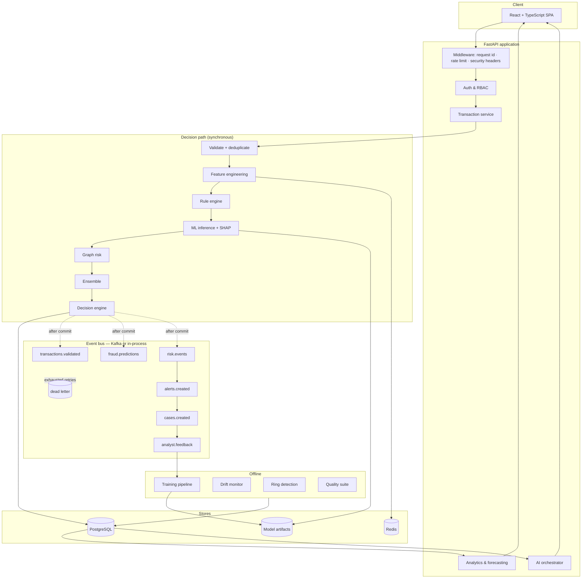

# FINGuard

**Real-time financial crime detection, risk decisioning and investigation platform.**

FINGuard scores every transaction through point-in-time features, an
analyst-authored rule engine, a gradient boosted model, graph neighbourhood risk
and a cost-aware decision policy — then records exactly why it landed where it
did, and lets an analyst investigate, decide, and feed that verdict back into the
next model.

```
Transaction → Validate → Deduplicate → Enrich → Features → Rules → Model → Graph
            → Ensemble risk → Decision → Alert/Case → Investigation → Feedback → Retraining
```

---

## Table of contents

- [What it does](#what-it-does)
- [Quick start](#quick-start)
- [Demo identities](#demo-identities)
- [Architecture](#architecture)
- [The decision path](#the-decision-path)
- [Machine learning](#machine-learning)
- [Graph intelligence](#graph-intelligence)
- [AI layer](#ai-layer)
- [Data platform](#data-platform)
- [Security and governance](#security-and-governance)
- [Measured performance](#measured-performance)
- [Testing](#testing)
- [Demo scenarios](#demo-scenarios)
- [Project layout](#project-layout)
- [Configuration](#configuration)
- [Docker](#docker)
- [Deployment](#deployment)
- [What is real and what is simulated](#what-is-real-and-what-is-simulated)
- [Future improvements](#future-improvements)

---

## What it does

| Question | Where it is answered |
|---|---|
| What is happening? | Command centre KPIs, live SSE transaction feed, global risk map |
| Is it suspicious? | Rule engine + XGBoost classifier + isolation forest + graph risk |
| Why is it suspicious? | Decision trace with SHAP attributions, rule matches and graph signals |
| What will happen next? | Volume, fraud and workload forecasts with stated backtest error |
| What should we do? | Cost-optimised decision engine and the what-if policy simulator |
| Can an analyst act on it? | Case workspace: timeline, evidence, AI summary, verdict, feedback loop |

**At a glance** (from one `make seed` run of 24,000 transactions):

| | |
|---|---|
| Database tables | 41, with foreign keys, indexes and Alembic migrations |
| API endpoints | 105 routes, OpenAPI documented, permission-gated |
| Features | 35 point-in-time features shared by training and serving |
| Detection rules | 16 shipped rules, editable and back-testable from the UI |
| Model quality | ROC-AUC **0.98–0.99**, PR-AUC **0.87–0.94**, recall **0.86–0.94** on a held-out chronological window |
| Decision latency | p50 **14–17 ms**, p95 **16–20 ms** (target p95 500 ms) |
| Tests | 113 backend, 28 frontend, 92 endpoint smoke checks — all passing |

---

## Quick start

**Requirements:** Python 3.11+, Node 20+. No other services are needed for the
default developer experience — SQLite, an in-process cache and an in-process
event bus stand in for PostgreSQL, Redis and Kafka with the same semantics.

```bash
# 1. install
cd backend && pip install -r requirements-dev.txt && cd ..
cd frontend && npm ci && cd ..

# 2. build the synthetic portfolio, score it, train the first models (~45s)
cd backend && python -m app.datagen.seed --reset

# 3. run the API  (http://localhost:8000/docs)
python -m uvicorn app.main:app --reload --port 8000

# 4. in another terminal, run the web app  (http://localhost:5173)
cd frontend && npm run dev
```

Then sign in at <http://localhost:5173/login> with any
[demo identity](#demo-identities) and press **Run detection** or a demo scenario
to watch the pipeline work.

Everything above is also wired into `make`:

```bash
make install    # dependencies
make seed       # synthetic portfolio + training
make api        # backend with reload
make web        # frontend
make test       # 141 tests
make smoke      # 92 endpoint checks against the seeded database
make bench      # measured latency percentiles
```

### Generate live traffic

```bash
cd backend && python -m scripts.stream_producer --rate 5 --duration 120
```

Transactions are scored through the real decision path and appear immediately in
the command centre feed, the alert queue and the monitoring dashboards.

---

## Demo identities

The seeder creates one account per role. Password for all of them:
`FinGuard#2026`.

| Email | Role | What it demonstrates |
|---|---|---|
| `admin@finguard.io` | ADMIN | Everything, including user management |
| `risk.analyst@finguard.io` | RISK_ANALYST | Rule authoring, simulation, thresholds |
| `investigator@finguard.io` | FRAUD_INVESTIGATOR | Cases, verdicts, **unmasked PII** |
| `scientist@finguard.io` | DATA_SCIENTIST | Training, promotion, drift, feedback |
| `engineer@finguard.io` | DATA_ENGINEER | Ingestion, pipelines, quality |
| `exec@finguard.io` | EXECUTIVE | Read-only reporting, **masked PII** |
| `auditor@finguard.io` | AUDITOR | Audit trail and governance only |

Signing in as the executive and then the investigator on the same customer is
the fastest way to see PII masking and permission gating actually working.

---

## Architecture



Full diagrams — transaction lifecycle, Kafka topology, ML lifecycle, AI
workflow, ER model and deployment — are in
[`docs/architecture.md`](docs/architecture.md); the requirements, trade-offs and
failure analysis are in [`docs/system-design.md`](docs/system-design.md).

---

## The decision path

Scoring is **synchronous** because the caller needs an answer. Everything
downstream — alerting, case creation, notifications, monitoring — is fanned out
over the event bus. Consumers are idempotent, so at-least-once delivery is safe,
and **events are published only after the database commit**, so a consumer can
never race a write it depends on.

| Stage | What happens | Measured p50 |
|---|---|---|
| Validate | Schema, amount, currency, coordinates, clock skew | < 0.01 ms |
| Deduplicate | `event_id` against the cache **and** the durable ledger | 0.23 ms |
| Enrich | Customer, merchant, account, device (created if unseen) | 0.62 ms |
| Features | 35 point-in-time features from history strictly older than the event | 2.19 ms |
| Rules | Every active rule evaluated against the feature namespace | 0.70 ms |
| Model | XGBoost probability + isolation forest + customer risk + SHAP | 7.87 ms |
| Graph | Device fan-out, IP fan-out, contaminated neighbours, ring membership | 1.38 ms |
| Ensemble | Weighted blend onto 0–100 | < 0.01 ms |
| Decide + persist | Threshold policy, then transaction, features, prediction, score, decision | 4.14 ms |
| **Total** | | **17.23 ms** |

### Idempotency

Replaying an `event_id` returns the original decision instead of double-charging
counters or opening a second case. Two independent guards back this: a cache
claim (fast path) and the `ingested_events` table (durable, survives a cache
flush).

### Point-in-time correctness

Every feature is computed from data that existed **strictly before** the
transaction being scored. The batch backfill injects the same neighbourhood
state it holds in memory into the *same* `compute_features` function the API
calls, so training data and serving data cannot drift apart. A test asserts the
two paths produce identical vectors, feature by feature.

---

## Machine learning

Three models, all registered, versioned and promotable:

| Model | Algorithm | Purpose |
|---|---|---|
| `fraud_classifier` | XGBoost | Supervised fraud probability |
| `anomaly_detector` | Isolation forest (fitted on legitimate traffic only) | Behaviour no label covers |
| `customer_risk` | Logistic regression on the behavioural profile | Customer-level risk |

**Training** (`app/ml/train.py`):

- Dataset assembled from the feature store, joined to labels.
- **Chronological** 70/15/15 split — never random, so the test window is
  genuinely "the future".
- `scale_pos_weight` set from the observed class ratio; fraud is ~1.1% here.
- The operating point is chosen by **minimising expected business cost** on the
  validation window, not by defaulting to 0.5.
- SHAP baseline statistics stored with the artifact for explanations and drift.
- Logged to MLflow when `MLFLOW_TRACKING_URI` is set; the `model_versions` table
  stays the serving source of truth either way.

**Measured on the held-out window** — two consecutive `make seed` runs of
24,000 transactions, `Fraud-XGB-v1`:

| Metric | Run A | Run B |
|---|---|---|
| ROC-AUC | 0.978 | 0.991 |
| PR-AUC | 0.873 | 0.939 |
| Recall | 0.860 | 0.938 |
| Precision | 0.681 | 0.484 |
| Chosen threshold | 0.024 | 0.073 |

Both runs are shown because the numbers **do** move between seeds: the synthetic
window is anchored to the current time, so the chronological split lands on a
different set of fraud episodes each run, and with ~264 fraud cases the test fold
holds only a few dozen. Reporting one run as *the* result would overstate the
precision of the measurement.

What is stable across runs is the shape: high recall, modest precision, and a low
threshold. That is the cost model working as intended — with a missed fraud at
₹50,000 and a false positive at ₹500, the optimiser buys recall cheaply. PR-AUC
and recall lead the table because accuracy at a 1% positive rate is meaningless;
the monitoring screen says so too.

**Why not accuracy:** a model that approves everything scores 98.9% accuracy on
this data and catches zero fraud.

**Cold start.** Before any model exists, the platform scores with a documented
logistic scorecard tagged `heuristic-scorecard-v1` and labels it as such in the
API, the trace and the UI. It is never presented as a trained model.

**Monitoring:** PSI and KS per feature plus prediction drift, with thresholds
0.10 (warning) and 0.25 (critical). When a model version changes inside the
comparison window the drift report says so, rather than reporting an expected
distribution shift as unexplained.

**Feedback loop:** every analyst verdict writes a `feedback_labels` row, updates
the transaction's ground truth, and credits or debits the precision of each rule
that fired on it. The retraining gate reads that backlog.

---

## Graph intelligence

Two deliberately different workloads:

- **Online** (`graph_risk`) runs inside the decision path and touches only the
  immediate neighbourhood: device fan-out, IP fan-out, contaminated neighbours,
  blacklisted devices, known-ring membership. A handful of indexed queries,
  ~1.2 ms.
- **Offline** (`detect_rings`) builds a real NetworkX projection of
  customer / device / IP / merchant, finds connected components induced by
  *shared infrastructure*, and scores each on size, density, contamination and
  value concentration. Only clusters above the risk floor are persisted.

The frontend renders the result with a force-directed layout implemented
directly against `requestAnimationFrame` — pan, zoom, hover and click, no
graph library.

`NEO4J_URI` switches the projection to Neo4j for the advanced profile; the
relational projection is the default because it needs no extra service and is
fast enough at this scale.

---

## AI layer

The AI is a **narrator, never a source of facts**.

1. **Evidence** is assembled deterministically from the database — features,
   rule hits, model attributions, graph signals, customer history. Every item
   carries the record it came from (`transaction_features.is_new_device`,
   `rule_executions.R-GEO-001`, …).
2. **Narrative** is either a language-model rendering of that evidence or a
   deterministic template. The response states which, every time.

With no provider configured the platform is fully functional: evidence
retrieval, SQL generation from a curated intent library, guardrails and logging
all work — only the prose becomes template-based.

**Text-to-SQL guardrails**, enforced server-side after generation:

- single statement only; must be `SELECT` or `WITH … SELECT`;
- no comments, no semicolons, no DDL/DML keywords;
- every referenced table must be on an allow-list **filtered by the caller's own
  permissions**;
- PII columns rejected for roles without `customer:pii_read`;
- a `LIMIT` is injected when absent;
- the generated SQL is shown to the analyst before the results.

Every AI interaction — question, generated SQL, row count, latency, outcome,
block reason — is written to `ai_queries` for governance review.

---

## Data platform

- **Catalogue**: 10 datasets with layer, owner, steward, classification, PII
  flag, row count and freshness SLA.
- **Quality**: 13 checks across completeness, validity, consistency, uniqueness,
  freshness and accuracy — all real SQL against the warehouse — rolled up into a
  Financial Data Trust Score (99.98% on the seeded data).
- **Lineage**: an interactive DAG from `transactions_raw` through to `cases`,
  including the feedback edge back to `transaction_features`.
- **Pipelines**: every backfill, aggregation, ring detection and quality run is
  recorded with records in/out, duration and per-step status.
- **dbt** (`infra/dbt`): staging models plus four marts — daily risk, merchant
  risk, customer risk and loss accounting — with schema tests.
- **Airflow** (`infra/airflow/dags`): a daily risk-operations DAG (quality →
  rings → drift → retraining gate) and an hourly health DAG. Both call the API
  rather than importing app code, so the scheduler needs no database
  credentials and is subject to the same RBAC as a human.
- **Spark** (`infra/spark`): a Structured Streaming enrichment job — the
  horizontally scalable form of the inline enrichment stage.

---

## Security and governance

| Control | Implementation |
|---|---|
| Authentication | JWT access tokens; refresh tokens stored server-side, rotated on use |
| Token reuse | Presenting a retired refresh token revokes the whole family |
| Brute force | Failed-login counter with temporary lockout; identical error for unknown and wrong-password |
| Authorisation | 30 permissions across 7 roles; **routes declare the permission, never the role** |
| PII | Masked in the serialisation layer every response passes through — a new endpoint cannot leak by omission |
| SQL injection | ORM-parameterised everywhere; AI SQL passes a separate allow-list validator |
| Rate limiting | Per-client fixed window; auth endpoints get a much lower ceiling |
| Headers | `nosniff`, `DENY`, `Referrer-Policy`, `Permissions-Policy`, HSTS in production |
| Audit | Append-only: who, what, when, where, why, request id, model version, rule version |
| Secrets | Environment only; the app **refuses to boot** in production with a dev JWT secret or on SQLite |
| Errors | Uniform envelope with a code and request id; stack traces never leave the server |

---

## Measured performance

Measured on a Windows development laptop with SQLite, single process, via
`make bench` (300 transactions, first 5 excluded as warm-up):

| Stage | p50 | p95 | p99 | Target p95 |
|---|---|---|---|---|
| Feature engineering | 2.19 ms | 3.12 ms | 3.40 ms | 120 ms |
| Rule engine | 0.70 ms | 0.79 ms | 0.96 ms | 40 ms |
| Model + SHAP | 7.87 ms | 8.85 ms | 10.14 ms | 100 ms |
| Graph risk | 1.38 ms | 1.66 ms | 1.93 ms | 80 ms |
| Persistence | 4.14 ms | 4.80 ms | 5.70 ms | 150 ms |
| **End to end** | **17.23 ms** | **19.77 ms** | **22.18 ms** | **500 ms** |

| Endpoint | p50 | p95 | Target p95 |
|---|---|---|---|
| `GET /transactions` | 6.84 ms | 8.54 ms | 300 ms |
| `GET /analytics/overview` | 4.21 ms | 5.19 ms | 300 ms |
| `GET /cases` | 7.88 ms | 9.11 ms | 300 ms |
| `GET /monitoring/system` | 6.15 ms | 8.24 ms | 300 ms |

Steady-state single-threaded throughput: **~60 decisions/second** (a second run
on a quieter machine gave 70/s — treat these as the same number). Cold start is
**3.6 s**: a one-time model artifact load plus SHAP explainer construction, paid
by the first request after a deploy. Model inference dominates the warm path, and
roughly half of that is SHAP.

These are the numbers this machine produced. They are not a claim about 5,000
TPS: reaching that needs the horizontal path described in
[`docs/system-design.md`](docs/system-design.md#scaling-to-5000-tps) — Kafka
partitions, stateless scorer replicas, Redis-backed feature lookups and
PostgreSQL read replicas. The architecture is built for it; this repository
demonstrates it at demo volume and reports what it measured.

---

## Testing

```bash
make test          # 113 backend + 28 frontend tests
make smoke         # 92 endpoint checks against a seeded database
```

**Backend (113 tests)** — rule grammar and evaluation semantics, ensemble
weighting and clamping, decision bands and rule-forced escalation, cost-optimal
thresholds, feature computation *including a point-in-time correctness test and
an online-vs-offline equivalence test*, PSI/KS statistics, password and token
handling, RBAC and PII masking, and API integration covering auth, idempotency,
error contracts, case workflow, AI guardrails and demo scenarios.

**Frontend (28 tests)** — formatting and risk-band logic, and component
behaviour including the decision trace, risk orb, pagination and accessible
progress semantics.

**Smoke (92 checks)** — every endpoint exercised against real seeded data,
including negative cases: injection attempts, permission denials, masked vs
unmasked PII, duplicate ingestion, and a check that the dead-letter queue is
empty.

**CI** (`.github/workflows/ci.yml`): lint → type check → migrations up *and*
down on real PostgreSQL → tests → seed + smoke → security scan → Docker build →
container health check.

---

## Demo scenarios

One click each, from the command centre. Every scenario builds real transactions
and pushes them through the live decision path.

| Scenario | What it shows |
|---|---|
| **Account takeover** | New device → impossible travel → escalating cash-out. Geography and device rules fire; risk escalates to review or decline. |
| **Fraud ring** | Several accounts on one shared device and IP. Fan-out rules fire, graph risk climbs, ring detection clusters them. |
| **Card testing** | A burst of tiny authorisations, then a large purchase that inherits the elevated profile. |
| **False positive** | A genuine large purchase is held, then cleared by an analyst — and the verdict enters the retraining set. |
| **Model drift** | A batch with a shifted amount profile pushes PSI across the warning threshold and raises a drift alert. |

---

## Project layout

```
finguard/
├── backend/
│   ├── app/
│   │   ├── core/          config, logging, errors, security, RBAC, cache
│   │   ├── db/            declarative base, session, 41 ORM models
│   │   ├── events/        event envelope, Kafka/in-process bus, consumers
│   │   ├── services/      features, rules, ml, graph, risk, decision, pipeline,
│   │   │                  cases, analytics, forecasting, quality, monitoring,
│   │   │                  audit, serializers, ai/
│   │   ├── ml/            registry, training, explainability, drift
│   │   ├── datagen/       synthetic generator, batch backfill, seeder
│   │   └── api/v1/        12 routers, 105 endpoints
│   ├── alembic/           migrations
│   ├── scripts/           smoke, benchmark, stream producer
│   └── tests/             113 tests
├── frontend/
│   └── src/
│       ├── components/    ui primitives, charts, layout, viz (orb, graph, trace)
│       ├── pages/         24 screens
│       ├── hooks/ lib/ store/
│       └── test/          28 tests
├── infra/
│   ├── airflow/dags/      daily and hourly DAGs
│   ├── dbt/               staging models + 4 marts
│   └── spark/             structured streaming enrichment
├── docs/                  system design, architecture, API, deployment
└── docker-compose.yml     profiled stack: core / streaming / ml / graph / orchestration
```

---

## Configuration

Everything is environment driven; see [`.env.example`](.env.example) for the
annotated list. Nothing is hard-coded and no secret has a working default.

Notable behaviour:

- `DATABASE_URL` — SQLite locally, PostgreSQL when deployed. Production mode
  refuses to start on SQLite.
- `REDIS_URL` / `KAFKA_BROKERS` — blank means the in-process implementation,
  which has the same interface, TTLs, retries and dead-letter semantics.
- `LLM_PROVIDER` — `none` keeps every AI surface working deterministically.
- `DECISION_*` and `COST_*` — the operating point and the cost model, used
  identically by the decision engine, the simulator and the dbt loss mart.

---

## Docker

```bash
docker compose --profile core up --build        # api + web + postgres + redis
docker compose --profile core --profile streaming up   # adds Kafka (KRaft)
docker compose --profile core --profile ml up          # adds MLflow + MinIO
```

The `seed` service runs migrations and builds the demo portfolio once; the `api`
service migrates and serves. The web image builds the SPA and serves it through
nginx, proxying `/api` to the API container so the browser sees one origin.

Web app: <http://localhost:8080> · API docs: <http://localhost:8000/docs>

---

## Deployment

[`docs/deployment.md`](docs/deployment.md) covers AWS ECS/Fargate, managed
PostgreSQL and Redis, MSK, S3 artifacts, secret management, scaling and
disaster recovery. The stack is cloud-portable: nothing depends on a
provider-specific API.

---

## What is real and what is simulated

Being explicit about this, because it is the difference between a demonstration
and a claim:

**Real** — the schema and migrations; the decision path and every measurement of
it; the rule engine; feature engineering and its point-in-time guarantees; model
training, evaluation, registry, promotion, rollback and drift; SHAP
explanations; graph projection and ring detection; case workflow and the
feedback loop; RBAC, PII masking, audit and AI guardrails; all analytics
(computed with SQL, never hard-coded); the event bus with retries, dead-letter
and idempotent consumers.

**Simulated** — the *data*. Customers, merchants, devices and transactions are
generated by `app/datagen/generator.py` with behavioural profiles and injected
fraud episodes. No real person's financial information is used anywhere, and
demo mode is labelled in the API payload and in the UI.

**Substituted by default** — Kafka, Redis and Neo4j have in-process equivalents
with the same interfaces so the platform runs on a laptop; set the environment
variables and the real drivers take over with no code change.

---

## Future improvements

- **Streaming feature store** — move velocity aggregates to Redis structures
  updated by the stream, removing the per-decision history query.
- **Champion/challenger** — serve two model versions in parallel on a traffic
  split and compare realised cost, not just offline metrics.
- **Case similarity** — embed case evidence to surface "we have seen this
  before" during investigation.
- **Rule mining** — propose candidate rules from analyst-confirmed fraud and
  present them with their back-test before an analyst activates them.
- **Sub-millisecond model serving** — export to ONNX and drop the Python
  inference hop.
- **Entity resolution** — merge synthetic identities that share attributes below
  the current device/IP threshold.

---

*Built as a demonstration of production financial-crime engineering. All
demonstration data is synthetic.*
# FINGuard

