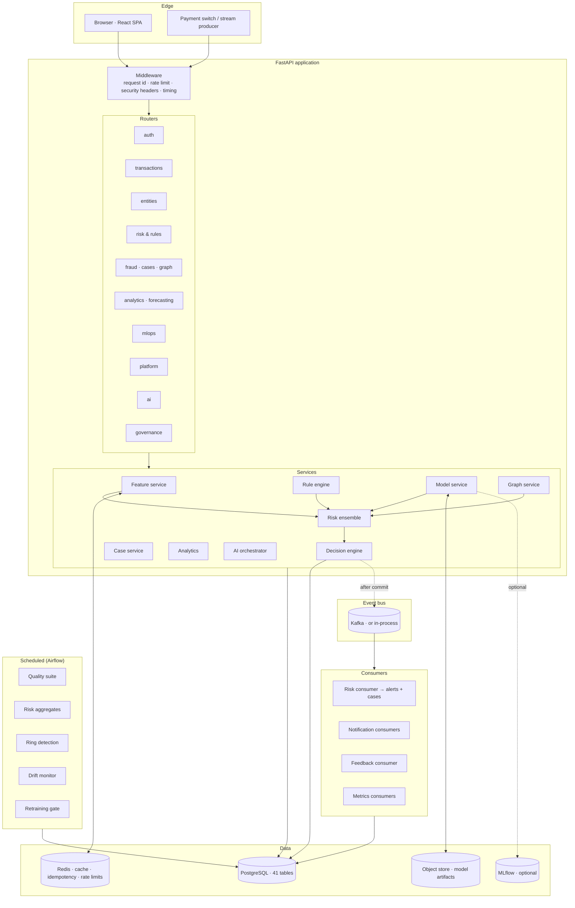
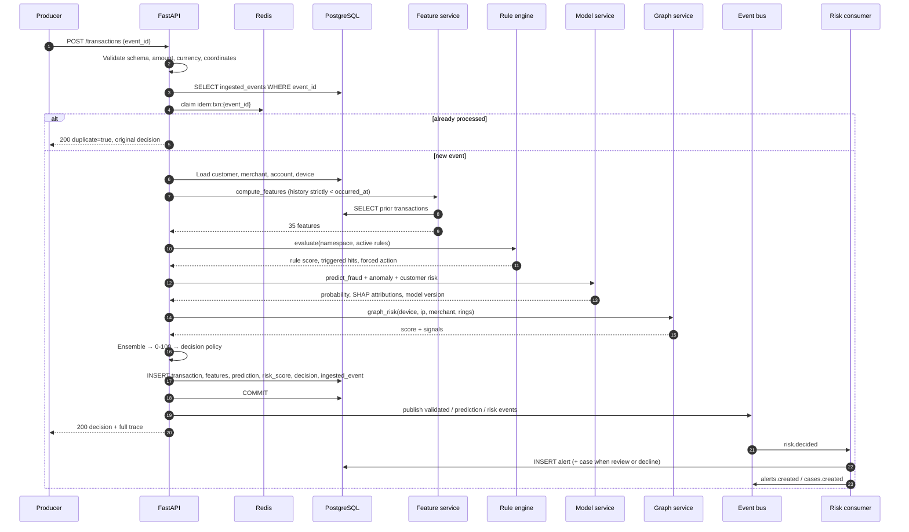
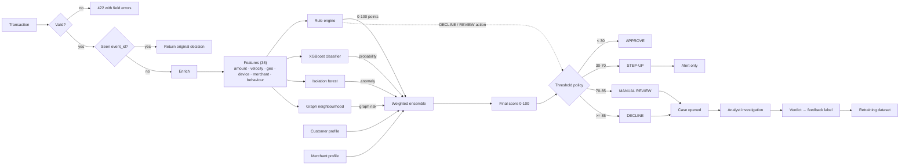
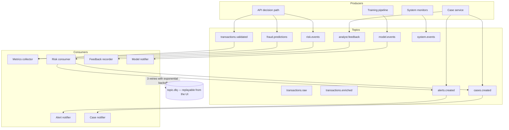
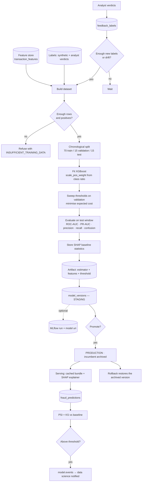
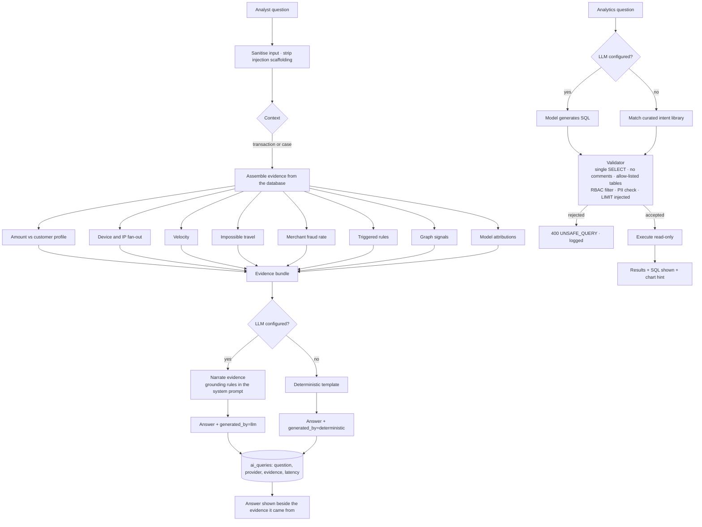
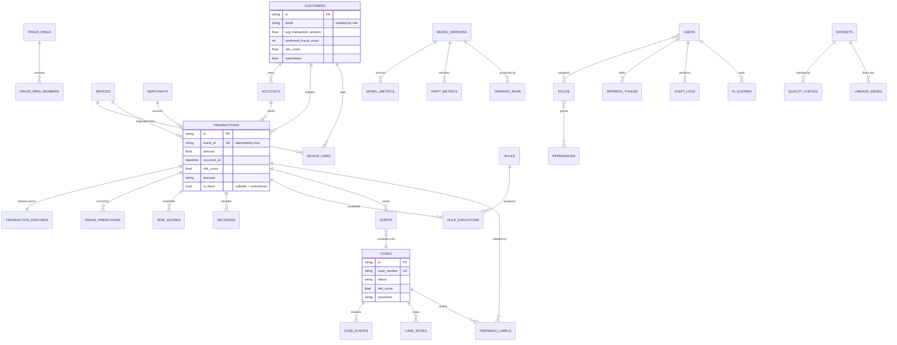
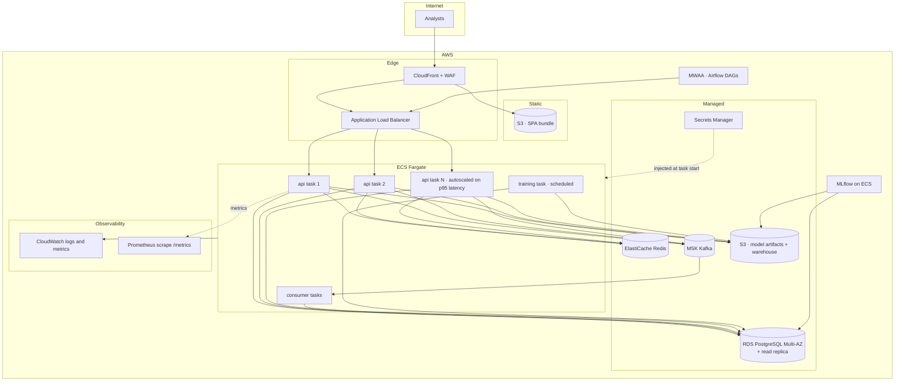

# FINGuard architecture diagrams

Eight views of the platform. Each renders on GitHub without a plugin.

1. [System architecture](#1-system-architecture)
2. [Transaction lifecycle](#2-transaction-lifecycle)
3. [Fraud detection pipeline](#3-fraud-detection-pipeline)
4. [Event bus topology](#4-event-bus-topology)
5. [ML lifecycle](#5-ml-lifecycle)
6. [AI investigation workflow](#6-ai-investigation-workflow)
7. [Database relationships](#7-database-relationships)
8. [Deployment architecture](#8-deployment-architecture)

---

## 1. System architecture

---

## 2. Transaction lifecycle

> Events are published **after** the commit. Consumers run concurrently and must
> never observe an event for a row that is not yet visible.

---

## 3. Fraud detection pipeline

Ensemble weights (normalised, configurable per simulation):

| Component | Weight |
|---|---|
| Model probability | 0.40 |
| Rule score | 0.22 |
| Graph risk | 0.14 |
| Anomaly score | 0.10 |
| Customer risk | 0.08 |
| Merchant risk | 0.06 |

---

## 4. Event bus topology

Delivery semantics: at-least-once. Handlers are idempotent (an existing alert
for a transaction short-circuits), retries use exponential backoff, and an
exhausted event is written to `dead_letter_events` with its payload, error and
attempt count — replayable from the System Health screen.

---

## 5. ML lifecycle

---

## 6. AI investigation workflow

---

## 7. Database relationships

---

## 8. Deployment architecture

Scaling levers, in the order they are reached:

| Constraint | Lever |
|---|---|
| API CPU | More Fargate tasks; the API is stateless |
| Feature query latency | Redis velocity aggregates; read replica for history |
| Model inference | Larger task, ONNX export, or a dedicated inference service |
| Event throughput | More Kafka partitions and consumer replicas (keyed by customer) |
| Write throughput | Partition `transactions` by month; batch feature-store writes |
| Analytics | Read replica, then a warehouse fed by the dbt marts |
